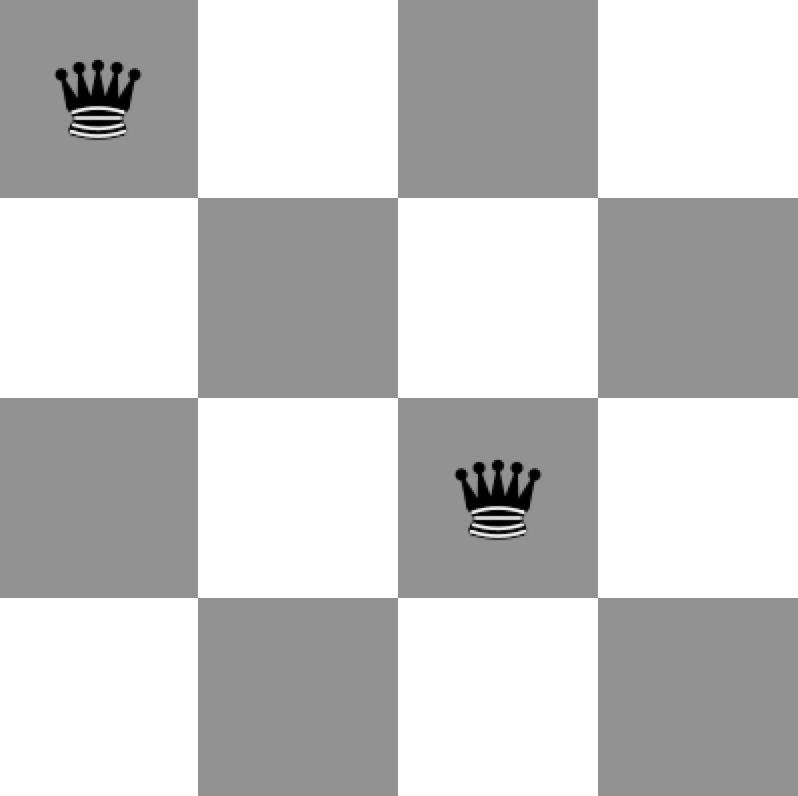
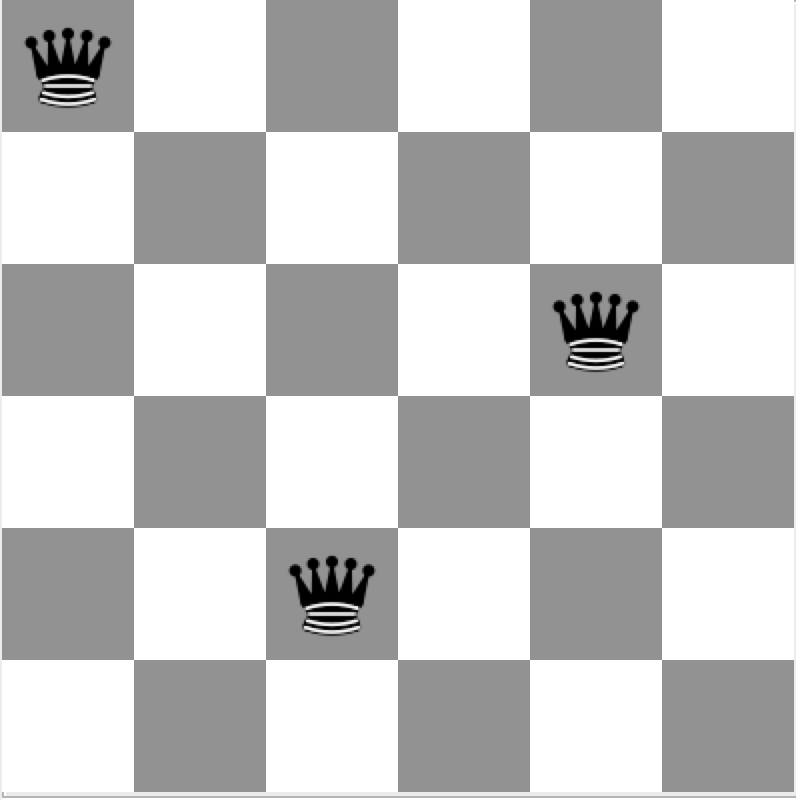
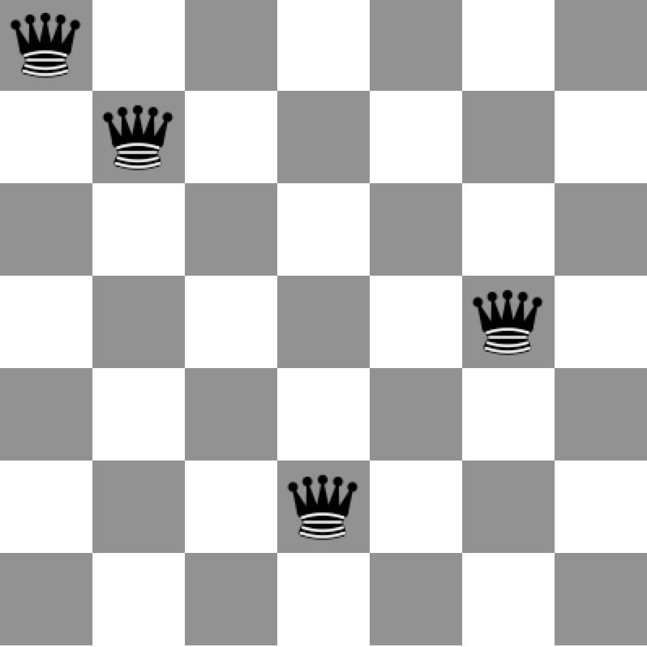
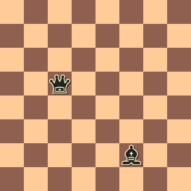
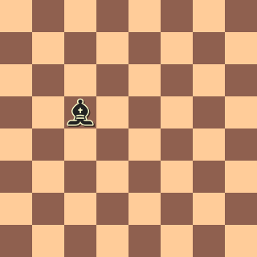
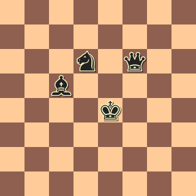

# Chess

**Due:** Commit until **10:00 AM** on the day of lab sessions.

## Setup

Checkout project `Chess` from SVN. To submit, commit your changes.

## Part I

When you check out the project, you will see
the following production classes and their
corresponding test classes:
`Bishop`, `Board`, `King`, `Knight`,
`Piece`, `Queen`, `Rook`.
Note that `Piece` is an abstract class.

You are provided with class stubs only:
Test classes are simply empty,
production classes contain method stubs that return trivial
values only to make the project compile without errors.

### Task

Implement test cases using JUnit.
You should try to have a good coverage of corner cases.
(E.g. what if parameters are negative?)

Do NOT touch the  production classes.
Leave them as given.
Write test cases according to the specification of the methods as given
in class skeletons.

Here is the `Board` class:

```java
public class Board {
    /**
     * Creates an 8-by-8 board
     */
    public Board() {

    }

    /**
     * Creates an N-by-N board
     * @param dimension the dimension of the board, that is N.
     * @throws IllegalArgumentException if the given dimension is non-positive
     */
    public Board(int dimension) {

    }

    /**
     * Places the given piece to location (x, y). Also sets the position of the piece
     * to (x,y). Coordinates are 0-indexed. (0,0) is the top-left corner of the board.
     *
     * @param piece to be put on the board.
     * @param x the vertical coordinate of the location.
     * @param y the horizontal coordinate of the location.
     * @throws IndexOutOfBoundsException if x or y is out of the boundaries of the board.
     * @throws AlreadyOccupiedException if a piece already exists at location (x,y).
     */
    public void put(Piece piece, int x, int y) {

    }

    /**
     * Returns the piece at the given location.
     * @param x
     * @param y
     * @return the piece object at location (x,y), or null if no piece exists on that location.
     */
    public Piece getPieceAt(int x, int y) {
        return null;
    }

    /**
     * Returns whether this board is "valid" or not.
     * For a board to be valid, no piece should be able to attack another.
     *
     * @return true if the board is valid; false, otherwise.
     */
    public boolean isValid() {
        return false;
    }

    /**
     * Returns the list of the pieces that were put on this board.
     * The pieces should be ordered according to the order in which they were placed.
     * @return the list of pieces
     */
    public List<Piece> getPieces() {
        return null;
    }

    /**
     * Return a string representation of this board,
     * where pieces are shown according to their symbol.
     * Sample output of toString() for a 4-by-4 board:
     * +-+-+-+-+
     * |R| | |R|
     * +-+-+-+-+
     * | | | | |
     * +-+-+-+-+
     * | |Q| |B|
     * +-+-+-+-+
     * | | |K| |
     * +-+-+-+-+
     *
     * @return the string representation of this board
     */
    public String toString() {
        return null;
    }

    /**
     * @return the dimension of this board.
     */
    public int getDimension() {
        return 0;
    }

    /**
     * Returns a deep copy of this board where each contained piece
     * is also cloned.
     * @return the clone of this board.
     */
    public Board clone() {
        return null;
    }

    /**
     * Decide if the given object is equal to this board.
     * A board is equal to another board if they contain the same
     * type of pieces on the same locations.
     */
    public boolean equals(Object that) {
        return false;
    }

    /**
     * Decide if location (x,y) on this board is available.
     * A location is available if it is not occupied and cannot be attacked by any piece.
     */
    public boolean isAvailable(int x, int y) {
        return false;
    }

    /**
     * Returns the most recent piece put on this board.
     */
    public Piece getLastPiece() {
        return null;
    }

    /**
     * Removes the most recently placed piece from this board.
     */
    public void removeLastPiece() {

    }

    /**
     * Returns whether this board is covered or not.
     * A board is covered if there does not exist an available cell on the board.
     */
    public boolean isCovered() {
        return false;
    }
}
```

Here is the `Piece` class:

```java
public abstract class Piece {
    /**
     * Returns true if this piece can attack, that is, can move to,
     * the given destination. Otherwise returns false.
     * A piece cannot attack its own location.
     *
     * @param i the vertical coordinate of the proposed destination on board
     * @param j the horizontal coordinate of the proposed destination on board
     * @throws IllegalArgumentException if i or j is negative.
     */
    public abstract boolean canAttack(int i, int j);

    /**
     * Sets the location of this piece to the cell at location x,y.
     *
     * @param x the vertical coordinate of the position
     * @param y the horizontal coordinate of the position
     * @throws IllegalArgumentException if x or y is negative.
     */
    public void setPosition(int x, int y) {

    }

    /**
     * @return the vertical, that is, the x coordinate, of this piece.
     */
    public int getX() {
        return 0;
    }

    /**
     * @return the horizontal, that is, the y coordinate, of this piece.
     */
    public int getY() {
        return 0;
    }

    /**
     * @return the clone of this piece.
     */
    public Piece clone() {
        return null;
    }

    /**
     * @return a one-character String as the symbol of this piece.
     */
    public abstract String getSymbol();
}
```


<a name="PartII"></a>

## Part II

In this part,
solve the [chessboard domination](http://en.wikipedia.org/wiki/Mathematical_chess_problem#Domination_problems)
problem:

> Given a number N and a piece type,
> find a configuration for an NxN board
> such that the board is covered using the minimum number of pieces of the given type.

For instance,
below are sample solutions for queens dominating 4x4, 5x5, 6x6, 7x7 boards.







### Implementation

For this, you are given the following class skeleton:

```java
package chess;

public class DominationSolver {
    /**
     * Solves the domination problem for a board of the given dimension
     * using pieces of the given type. A board is "dominated" if all the cells
     * are either occupied or can be attacked by a piece on the board.
     * The problem must be solved using the minimum number of pieces.
     * The returned board is one of the possibly many solutions.
     * @param dimension a positive integer as the dimension of the board
     * @param piece the piece that will be cloned and put on the board for solving
     *              the problem.
     * @return a solution board, or null if a solution does not exist.
     * @throws IllegalArgumentException if the dimension is non-positive
     */
    public Board solve(int dimension, Piece piece) {
        return null;
    }
}
```

Do NOT change the signature of the `solve` method.
We will grade the functionality of your code
by calling this method.
You MAY add new methods to the provided class.

A separate class that includes a `main` method has been given
for your convenience as well.

### Testing

Before you start coding, write test cases for the `DominationSolver` class.
I committed a skeleton `DominationSolverTest` class to your folder.


### New code

I added three new classes to your folder:
`DominationSolver`, `Main`, `DominationSolverTest`.
I also updated the `Board` class; I removed the `print()`
method, and instead I included `toString()`.
I also changed the string output a bit.

To get the new code, do a right-click on your `src` folder, and
choose Subversion -> Update.

<a name="PartIII"></a>

## Part III

In this part you will "reduce" a given board by
making pieces attack each other.
Each attack gives you points according to the "value"
of the captured piece.
Your goal is to maximize the total points.
To simplify the problem,
here is a restriction:

* You can move a piece only if it is able to attack
another piece; you cannot make a piece move to an
unoccupied cell.

This means, a board is already "reduced" and yields 0 points
if it is a valid board.

For this problem,
you'll be provided with skeleton classes
named `Reducer` and `ReducerTest`.
Also add the following method to your
`Piece` class:

```java
/**
 * @return the relative value of the piece
 */
public abstract int getValue();
```

Override this method in your piece classes
according to the following values:

* King: 2
* Knight: 3
* Bishop: 3
* Rook: 5
* Queen: 9

### Example 1

Consider the board on the left below.
Here, the pieces can attack each other.
Because a queen is more valuable,
the reducer should prefer to capture the queen using the bishop,
and not vice versa.
After the capturing move, no more move is possible.
The reducer yields the board on the right hand side, and 9 points.




### Example 2

Consider the situation below:



Here, a possible sequence of moves is this:
Bishop captures the knight, queen captures the bishop,
yielding 6 points.

Another possible sequence is:
Knight captures the king, then captures the queen,
yielding 11 points.

Yet another is:
Queen captures the knight, bishop captures the queen,
yielding 12 points.


## Grading

**CAUTION:**
We will grade your code by replacing your `Board`, `Piece`, etc. classes
with our own implementations. Therefore, it is very important that you
do **NOT** change the signature of the public methods we gave you in the skeleton
code. You may add **private** methods to make your code clean, though.
Also, all the fields that you add should be **private** and should be accessed
from outside via set/get (i.e. accessor) methods only.

**COMPETITION:**
Part of your grade will be based on a competition
that we will run using your `DominationSolver` and `Reducer`.

**CORRECTNESS:**
We will do **automated grading** for correctness.
For this, we will run our own test cases against your production classes.
If your class fails a test case, you will receive zero credit
for that test.

This particularly means that

* we can't give partial credit by manually
examining your code or fixing bugs in your code.
* if your code does not compile, there will be severe point deductions.

**WEIGHTS:**

* Cleanness: 40%
* Coverage of test cases: 15%
* Correctness of piece and board classes: 15%
* Correctness of DominationSolver: 15%
* Correctness of Reducer: 15%


