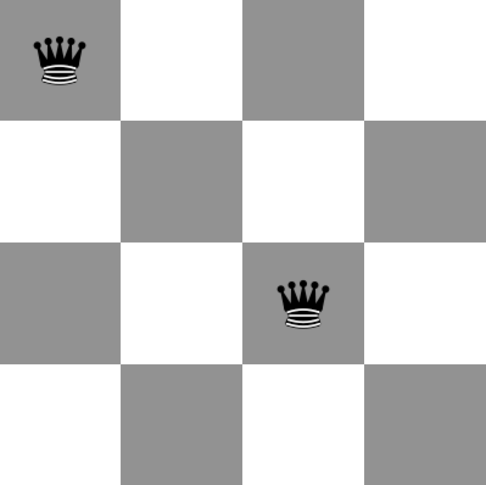
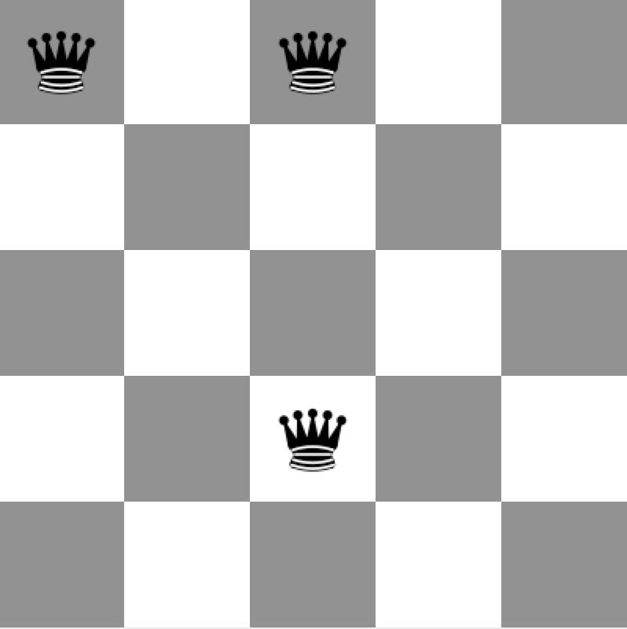
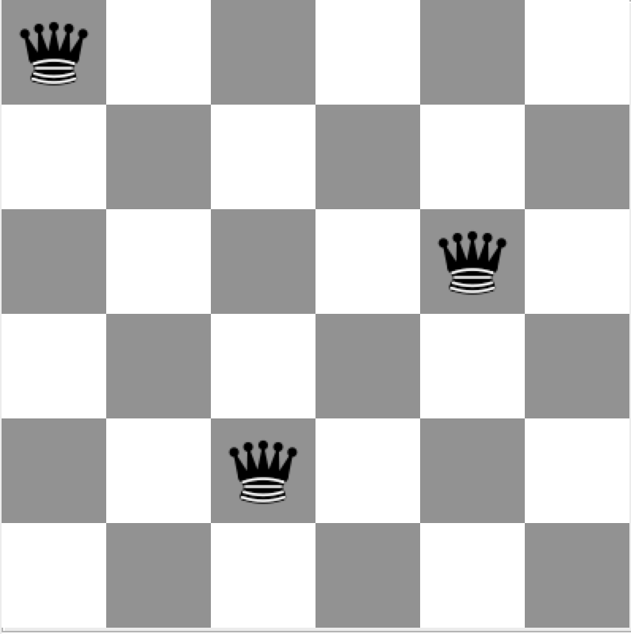
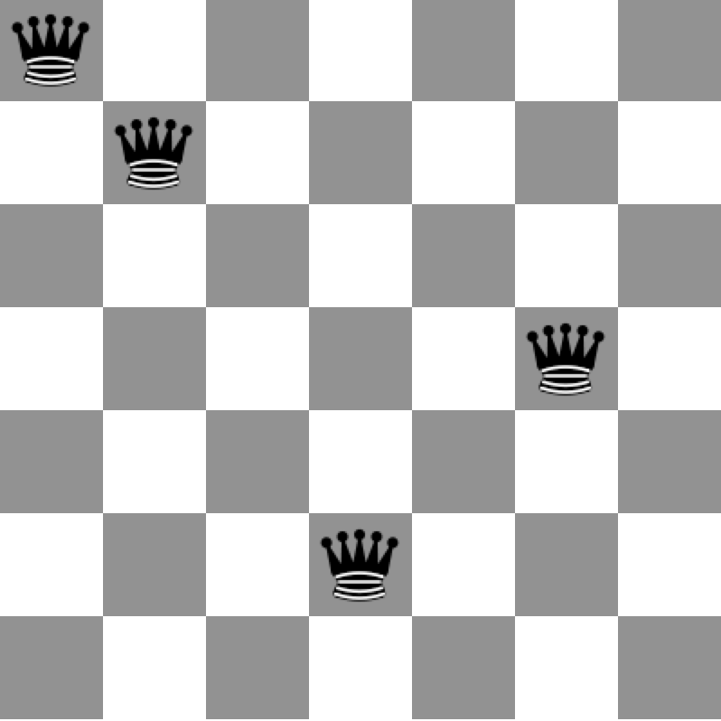

# Chessboard, Part I
**Due:** April 21st, Tuesday, **20:00**.

**Language:** Java (with JUnit)

**Goal:** Practice Test-Driven-Development by writing unit tests.

**Submission:** Check out project **Chessboard** from SVN.

## Code Reading
In this assignment, you will be responsible for another student's code.
You must read the student's code **before** the discussion and come ready with
a report that answers the following questions:

+ Are there any test cases that make your peer's test suite
  better than yours, in terms of coverage?
+ Are there any test cases that make your test suite
  better than your peer's, in terms of coverage?
+ What suggestions would you give to your peer to improve the cleanliness of their code?

Your discussion session moderator will send you your peer's code via email.

## The Problem: Queens on a Chessboard
This is a classic computer science problem that asks 
the configurations that you can create such that _n_ queens occupy _n_ distinct spots 
on an _n_x_n_ by chess board such that no two queens can attack each other. 
This means that no two queens can share a row, a column, or a diagonal. 
There are solutions for all natural _n_ except 2 and 3. 
Play the game below to get a feel for how it works:  
<http://www.coolmath4kids.com/math_puzzles/Logic-eightqueens/index.html>

For some extra background information, it may help to read  
<https://en.wikipedia.org/wiki/Eight_queens_puzzle>

Your task for this week is to write test cases for code that doesn't exist yet.

## Test cases
Write test cases for the `Piece`, `Queen`, `Board`, `NQueensSolver`
classes.
**In this assignment, you will not implement the method bodies
of any of these
classes; you will only write test cases.**

Test case classes should be put in a package named **queens.tests**.

Good testing requires you to test for the unexpected. 
Every function should have _at least_ one test. 
However to get full credit,
you should write tests which cover all corner cases and other possibilities 
that your program may eventually encounter. 

## Abstract classes
Hmm, abstract classes cannot be instantiated.
So, how do you write test cases for abstract classes?
Maybe the test class for an abstract class shall be abstract as well?

## Grading
+ Coverage of test cases (10)
+ Code quality (8)
+ Preparedness for discussing your peer's code (5)

---

<a name="Part_II"></a>

# Part II
**Due:** May 5th, Tuesday, **20:00**.

**Goal:** Implement the N-Queens problem for 
which you wrote test cases.
Also review the code of a friend of yours.

## Task
You will write a console-driven program that will prompt the user to enter the 
size of the board. 
Then, for that size, it will print out all the possible solutions.
Below is a possible way you can display a board (this board also happens to 
be an 8-queen solution):

```
    +-+-+-+-+-+-+-+-+
    | | | | | | | |Q|
    +-+-+-+-+-+-+-+-+
    | | | |Q| | | | |
    +-+-+-+-+-+-+-+-+
    |Q| | | | | | | |
    +-+-+-+-+-+-+-+-+
    | | |Q| | | | | |
    +-+-+-+-+-+-+-+-+
    | | | | | |Q| | |
    +-+-+-+-+-+-+-+-+
    | |Q| | | | | | |
    +-+-+-+-+-+-+-+-+
    | | | | | | |Q| |
    +-+-+-+-+-+-+-+-+
    | | | | |Q| | | |
    +-+-+-+-+-+-+-+-+
```

Note that for n=8, there are 4,426,165,368 
possible arrangements of 8 queens on the board (64 choose 8).
You must use a somewhat "smart" algorithm; that is, a brute-force solution
that checks all the possible arrangements will be frowned upon. 

Follow the class outlines given to you in the previous 
assignment; however, you are free to add new methods and classes,
as you see fit.

## Grading
+ Correctly calculating the queens problem. (10)
+ Clean code. (10)
+ Preparedness for reviewing your peer's code. (5)

---

<a name="Part_III"></a>

# Part III
**Due:** May 19th, Tuesday, **20:00**.

## Task
Extend your N-Queens program to also include
the following puzzles. In all, the board size is fixed to 8.
Idea is the same; put N pieces on a chess so that
no one can attack each other.

* 14 Bishops 
* 16 Kings
* 8 Rooks

Follow the TDD principle. Write test cases first,
then implement the classes.

Improve code reuse in your program through inheritance.

## Grading
+ Test cases. (10)
+ Correctly solving the puzzles. (10)
+ Clean code. (10)
+ Preparedness for reviewing your peer's code. (4)

---

<a name="Part_IV"></a>

# Part IV
**Due:** May 19th, Tuesday, **20:00**.

## Task
Make a GUI for your chessboard puzzle program.
[Here is mine](https://vimeo.com/127400793).
Yours doesn't have to be exactly the same.
Be creative.

**Apply the MVC pattern principle.**

## Grading
+ MVC structure. (8)
+ Properly enabled/disabled buttons. (2)
+ Board visualization with various dimensions. (5) 
+ Clean code. (10)
+ Preparedness for reviewing your peer's code. (4)

---

<a name="Part_V"></a>

# Part V
This part is a **make-up assignment**.

**Due:** June 5th, Friday, **23:55**.

## Task
Solve the [chessboard domination](http://en.wikipedia.org/wiki/Mathematical_chess_problem#Domination_problems)
problem:

> Given a number N,
> what is the minimum number of pieces
> needed such that every square on an N x N chess board can be attacked?

Implement **4** variations of this problem
using queens, kings, rooks, and bishops.

Also, include the domination problem in your chessboard **GUI**.

You should write your test cases **before** you start implementing your solution.

Below are three sample solutions for queens dominating 4x4, 5x5, 6x6, 7x7 boards.







