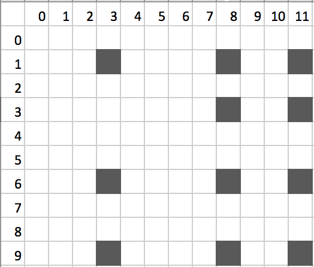

# Assignment: Squares in the map

**Language:** Java or C++

**Goal:** Count the number of squares in a map of points.

### Setup
Check out the project from
the following URL, where you
should **replace donald.duck with your user name**:

<https://srl.ozyegin.edu.tr/cs222hws/sp15/donald.duck/InClass01>


### Task
Write a program named `Assignment` in the **default package**.

Your program will read coordinates of points in an NxM map.
Then, the program will report the number of squares than can be formed
with these points.

Your program will read the size of the map as the first input.
Next, the coordinates of the points will be entered on each line.
Entering -1 -1 indicates the end of the entries.
You program will terminate by displaying the number of squares.

Indexing of the points in the input starts from 0.
The points may be entered in any order.
You may assume that the user will always enter inputs in correct format;
you don't need to check for bad input format.

Here is a sample run, where the user enters 11 points in a 10x12 map.
The first point is at coordinate (1,3),
the next is at (6,3), the next is at (1,8), and so on. 

```
Enter the map size: 10 12
Enter point> 1 3
Enter point> 6 3
Enter point> 1 8
Enter point> 1 11
Enter point> 3 8
Enter point> 3 11
Enter point> 6 8
Enter point> 6 11
Enter point> 9 3
Enter point> 9 8
Enter point> 9 11
Enter point> -1 -1

4 squares can be formed in this map.
```

A visualization of the point map above is as follows:



Here, the possible squares are:

* top-left corner is at (1,3), top-right is at (1,8).
* top-left corner is at (1,3), top-right is at (1,11).
* top-left corner is at (6,8), top-right is at (6,11).
* top-left corner is at (3,8), top-right is at (3,11).

### Suggested algorithm
Create a two-dimensional boolean array of size NxM.
Fill in the values of this array according to user input.
A true value means there exists a point at that coordinate.

For each point *p* in this array, do the following:
Take a look at each point *q* on the same row as *p*.
If you find out that there exists another point on the same column
as *p* at the same distance as *q*, and also another
point on the same column as *q* at the same distance as *p*,
then a square may be formed whose top-left
corner is *p* and top-right corner is *q*. 

