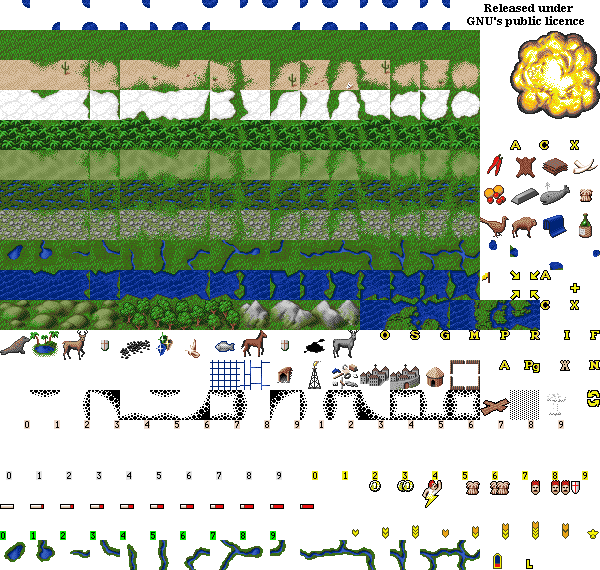

## Assignment 3.2 - Generating a Terrain Map Image

**Due:** April 2nd, Wednesday, 16:00  
**Language:** Java  
**Goal:** Read an ASCII input file that represents a terrain and
    generate an html file to display the map of the terrain.

### Submission
Continue working on project **Assignment_3**.
Commit your changes to the repository by the deadline.

## Task
Read ASCII terrain description and the binary neighborhood grid.
Based on those files, generate a map image.
The output will look something like [this](data/terrain_17_30.html),
generated from the 
sample 17x30 terrain from the previous assignment.

We will do all of this with some simple CSS and HTML. 
This way we do not have to worry about image libraries
and all of the details they entail. 
We will be using an image that contains multiple configurations of each tile.
The image below has been taken from the FreeCiv game. 
Please take a look at it. 
We will not be using all the image inside for this assignment. 
We will be making use of **g**rass, **d**esert, **i**ce, **j**ungle, **p**lains, 
**s**wamps, **r**oads, **w**ater, **h**otrocks, **f**orest and **m**ountains. 
All the images that we use are illustrated in the map above. 
Please right click and save the image below to use in your project.



If you take a close look at this image, 
you will see that it is composed of tiles of our different terrain types, 
with varying neighbors. If you inspect it even closer, 
you can see that they are all arranged in a very particular order. 
The first tile in a row (take the desert tiles for example) 
shows just that tile with no neighbors of differing types, 
the second has a different neighbor on the north side, 
the third has a different neighbor on the west side, and so on. 
If we count in base 2, we see the following:

<p>
<table border="1">
<tr><th>West</th><th>South</th><th>East</th><th>North</th></tr>
<tr><td>0</td><td>0</td><td>0</td><td>0</td></tr>
<tr><td>0</td><td>0</td><td>0</td><td>1</td></tr>
<tr><td>0</td><td>0</td><td>1</td><td>0</td></tr>
<tr><td>0</td><td>0</td><td>1</td><td>1</td></tr>
</table>

And so on...

Notice how this pattern resembles the output format of our previous week's code. 
Remember, a 1 signifies that the neighbor on that side is different than that cell, 
while a 0 means that they are the same. So, you will

+ Read in both the original map file and the output 
  of your code from last week for the original map file.
+ For each cell in the map, generate a portion of HTML code
  for that cell and write it to file.

You will read in each cell and transform it into a CSS class name. 
For instance, if you read in `g` from the original map and a byte with the bits 
`11011010` from your output of last week's code, you will generate the CSS class 
`g_1_0_1_1` (notice how the numbers in the CSS class correspond to bits 7, 5, 3, and 1 respectively).


### How to use HTML
Write an HTML file where each cell corresponds to a character in the terrain definition.
To create a table in HTML, see the example below:
  
```html
<html>
<body>
  <!-- this is the start of the table --> 
  <table border="1">
    <!-- this is the start of the first row --> 
    <tr>
      <!-- this is the first row, first column --> 
      <td>some text here </td>
      <!-- this is the first row, second column --> 
      <td>more text here </td>
    <!-- ending the first row -->
    </tr>
    <!-- this is the start of the second row --> 
    <tr>
      <!-- this is the second row, first column --> 
      <td>some text here </td>
      <!-- this is the second row, second column --> 
      <td>more text here </td>
    <!-- ending the second row -->
    </tr>
  <!-- ending the table --> 
  </table>
</body> 
</html>
```

This is is just for example, as you will see soon, 
our output table will not require text in each cell of the table 
since we will be assigning it a CSS background.

### How to use CSS
CSS is an easy way to style HTML pages. 
To start off, make sure the image of the tiles you downloaded is in the same directory 
as the HTML file and CSS file you are about to create. Here is an example CSS file:

```css
/* In this case, .g is how you define a class called g */
.g{
  height: 30px;
  width: 30px;
  background: url(tiles.png); 
  background-position: 0px -30px; 
  overflow: hidden;
  border-width: 0px;
}

.d{
  height: 30px;
  width: 30px;
  background: url(tiles.png); 
  background-position: 0px -60px; 
  overflow: hidden;
  border-width: 0px;
}
```

You will need to create one CSS class for each type of terrain 
(notice how the background-position changes for each of the different types of terrain). 
But, this CSS file will only have the classes necessary for cells that have no neighbors, 
which will make for an ugly map. So, you will need to create a CSS file that looks like the following:

```css
.g_0_0_0_0{
  height: 30px;
  width: 30px;
  background: url(tiles.png); 
  background-position: 0px -30px; 
  overflow: hidden;
}
.g_0_0_0_1{
  height: 30px;
  width: 30px;
  background: url(tiles.png); 
  background-position: -30px -30px; 
  overflow: hidden;
}
```

You will need one CSS class per tile on the image, 
so 16 per terrain type. 
Although this CSS file is static (i.e. it's the same for all terrain inputs),
it is a requirement of this 
assignment that you write a helper program to create this file for you, 
since it will be extremely tedious and error-prone to do it by hand.
Once you have your CSS file created, you can create an html file 
to display the image. It might look something like:

```html
<html>
<!-- Here we include the .css file. 
     Think of it as import in Java or #include in C -->
<link rel=stylesheet href="tiles.css" type="text/css" media=screen> 
<table border="1" cellspacing="0" cellpadding="0">
  <tr>
    <td class="g_1_0_1_1"> </td>
    <td class="d_1_0_1_1"> </td>
  </tr> 
  <tr>
    <td class="g_1_1_1_0"> </td>
    <td class="d_1_1_1_0"> </td>
  </tr> 
</table>
</html>
```

Once you are finished, you should be able to open the resulting HTML file and see the map in its full glory.

For the 17x30 terrain, my program generates
this [terrain\_17\_30.html](data/terrain_17_30.html)
(right-click and save-as...).
I have a CSS generator that produces this
[tiles.css](data/tiles.css) file.

### User interaction
Your program should ask the uset to enter a file, then use this name 
to read the terrain, the neighborhood data (i.e. the file your generated in Assignment 1.1)
and output the html. E.g:

```
Enter the file name, without the extension: terrain_17_30
Read terrain_17_30.txt, terrain_17_30.bin; generated terrain_17_30.html.
```
  
### Recommendations
+ Modularize your code as much as possible. Use multiple functions 
  and files to separate out the key pieces of logic.
+ Use a helper program such as Firebug to help debug your output 
  (Safari also has a great developer menu that can help a lot).

### Things to watch out for
+ How do you handle tiles that don't have neighbor tiles (such as forest, mountain, and hotrock)?
+ Are you generating the CSS by hand? DON'T!

### Grading
+ Requirement Satisfaction
    * Your program can properly read the input files - 2
    * Your program can generate an HTML table correctly representing the map - 7 
    * You wrote a helper script to generate the CSS - 5
    * You properly handled the tiles that have no neighbors - 2

+ Style
    * You used adequate and meaningful comments - 2
    * Your code is nicely modularized into methods and classes - 6
    * You used meaningful names - 4
    * Code is easily adaptable to change - 3


