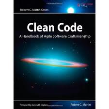

_Some videos may require a passkey due to copyright issues._

## Book



**Required Textbook:**
Robert Martin. <a href="http://www.amazon.com/Clean-Code-Handbook-Software-Craftsmanship/dp/0132350882">Clean Code: A Handbook of Agile Software Craftsmanship</a>, Prentice Hall.

Due to copyright issues, slides of the textbook will only be posted to Ozyegin University's 
[Learning Management System](http://lms.ozyegin.edu.tr).

## Subversion
Your SVN space is

```
https://srl.ozyegin.edu.tr/cs222sp18/YOUR_SVN_USERNAME/
```

`YOUR_SVN_USERNAME` and password will be emailed to you. 

+ A brief and nice [SVN tutorial](http://code.google.com/p/westmont-risk/wiki/SvnTutorial)
+ Optional: [Using SVN on the terminal](https://vimeo.com/91285459).
  This is not required and will not be needed
  in our course; we will interact with the SVN via the IDE.
  However, it's a good idea to be familiar with SVN on the command line,
  and to be aware that a version control system is indepedent from the IDE you're using.

## Clean Code
+ [Meaningful names](https://vimeo.com/86404712)
+ Robert Green and Henry Ledgard. 2011. Coding guidelines: Finding the art in the science. _Commun. ACM 54_, 12 (December 2011), 57-63. <http://doi.acm.org/10.1145/2043174.2043191>
+ [Comments](https://vimeo.com/86878161)
+ [Functions](https://vimeo.com/87260502)
+ [Format](https://vimeo.com/88440095)
+ [Code smells](https://vimeo.com/88445610)
  * <https://wiki.engr.illinois.edu/display/cs242sp13/Code+Smells>
  * <http://www.codinghorror.com/blog/2006/05/code-smells.html>
  * <http://c2.com/cgi/wiki?CodeSmell>


## Refactoring
+ Bob Martin, <a href="data/craftsman1.pdf">The Craftsman #1</a>.
+ Bob Martin, <a href="data/craftsman2.pdf">The Craftsman #2</a>.
+ Bob Martin, <a href="data/craftsman3.pdf">The Craftsman #3</a>.
+ Refactoring case study: [Generating prime numbers](https://github.com/aktemur/CS222).
+ Refactoring case study: [Movie Store](https://github.com/aktemur/MovieStore).
  See the [commit history](https://github.com/aktemur/MovieStore/commits/master)
  for a step-by-step evolution.

## Debugging
+ Using the debugger (ReverseArray example): <http://vimeo.com/37430218>
+ Using the debugger to view a scope: <http://vimeo.com/37430879>
+ Using the debugger to inspect objects: <http://vimeo.com/37431722>
+ Using the debugger for bit-level operations: <http://vimeo.com/37432351>

## Test-Driven Development
+ A case study of writing unit tests with JUnit for the [Rational class](https://github.com/aktemur/CS222). [[Slides]](data/TDD.pdf)
+ Wikipedia entry on [TDD](http://en.wikipedia.org/wiki/Test-driven_development).
+ [Eclipse and JUnit](https://courses.cs.washington.edu/courses/cse143/11wi/eclipse-tutorial/junit.shtml)
+ [JUnit annotations](http://www.vogella.com/tutorials/JUnit/article.html#usingjunit_annotations)

## Java
+ [Scanner](https://vimeo.com/123603879)
+ [ArrayList and generics](https://vimeo.com/90197868)
+ [Static import](http://docs.oracle.com/javase/1.5.0/docs/guide/language/static-import.html)
+ [Enum](http://docs.oracle.com/javase/1.5.0/docs/guide/language/enums.html)
+ [List processing and lambdas](https://github.com/aktemur/CS222/)

## MVC
+ [Slides](data/MVC.pdf)
+ [Die roller, Minesweeper, TicTacToe code](https://github.com/aktemur/CS222) (see the MVC folder)

## A crude introduction to concurrency in Java
+ [Examples using Threads and Timer](code/ThreadAndTimer.zip)

## Networking in Java
+ [Client/Server examples](code/network.zip)

## Misc.
+ Joel's <a href="http://www.joelonsoftware.com/articles/CollegeAdvice.html">advice</a> to CS students. 
+ Joel's <a href="http://www.joelonsoftware.com/articles/fog0000000043.html">12 steps</a> to better code.
+ Pointer fun with <a href="http://www.youtube.com/watch?v=6pmWojisM_E">Binky</a>.
+ Bret Victor's excellent talk on <a href="https://vimeo.com/36579366">interactive programming</a>.
+ Bob Martin's <a href="http://www.amazon.com/Clean-Coder-Conduct-Professional-Programmers/dp/0137081073">The Clean Coder</a>
  (you **must** read this before you graduate).
+ Eric Steven Raymond's ["How To Ask Questions The Smart Way"](http://www.catb.org/~esr/faqs/smart-questions.html)
+ [Java Tutor](http://www.pythontutor.com/java.html)
+ [Kevlin Henney - Seven Ineffective Coding Habits of Many Programmers](https://www.youtube.com/watch?v=ZsHMHukIlJY)
