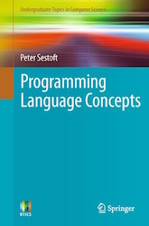

## Resources

**Required Textbook:** 
Peter Sestoft, _Programming Language Concepts_, Springer, 2012.
[Textbook web](http://www.itu.dk/people/sestoft/plc/)

## Links
* [Ocaml.org](https://ocaml.org)

* [F# Software Foundation](http://fsharp.org)

* [Elsa Gunter](http://courses.engr.illinois.edu/cs421/fa2013) and 
  [Sam Kamin's](http://courses.engr.illinois.edu/cs421/sp2013)
  course on Programming Languages and Compilers. 

* [Jason Hickey's online book](http://courses.cms.caltech.edu/cs134/cs134b/book.pdf) about OCaml. 

* [Rowan Davies' course](http://undergraduate.csse.uwa.edu.au/units/CITS3242/) on Programming Paradigms.

* [Bj&ouml;rn Lisper's course](http://www.idt.mdh.se/kurser/DVA201/) on Functional Programming with F#. 

* [Expert F# 2.0](http://ninova.ozyegin.edu.tr/record=b1110220~S0) by Syme, Granicz, Cisternino. 
  Available in the library as an e-resource.

* [Programming F#](http://ninova.ozyegin.edu.tr/record=b1109145~S0) by Chris Smith.
  Available in the library as an e-resource.

* [Dan Grossman's Coursera course](https://class.coursera.org/proglang-002) on Programming Languages.

* [From Java to C++](http://courses.washington.edu/css342/zander/css332/)

* [Crafting Intepreters](http://www.craftinginterpreters.com)

<!--
* **Installing F#:** See the instructions at [FSharp.org](http://fsharp.org).
  When choosing the system you will work on,
  consider the fact that you will need to use the [grader](graderTutorial.html) for the assignments/exams.
  You will have to install [FSharp PowerPack](http://fsharppowerpack.codeplex.com) (for the Lexer and Yacc) as well.

* You can use F# on your browser. Go to the [Try F#](http://www.tryfsharp.org) web site. 
Try out the [tutorials!](http://www.tryfsharp.org/Tutorials.aspx).
-->
  
