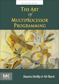

## Resources

**Textbook:**  

[_The Art of Multiprocessor Programming, Revised Reprint_](http://www.elsevier.com/books/the-art-of-multiprocessor-programming-revised-reprint/herlihy/978-0-12-397337-5#)  
Maurice Herlihy, Nir Shavit.  
May 2012, Morgan Kaufmann. ISBN: 978-0-12-397337-5

[E-Book version from the library](http://proquestcombo.safaribooksonline.com/book/programming/9780123973375)

[Deadlock Empire](https://deadlockempire.github.io/)

[Sophomoric Parallelism and Concurrency](http://homes.cs.washington.edu/~djg/teachingMaterials/spac/)
