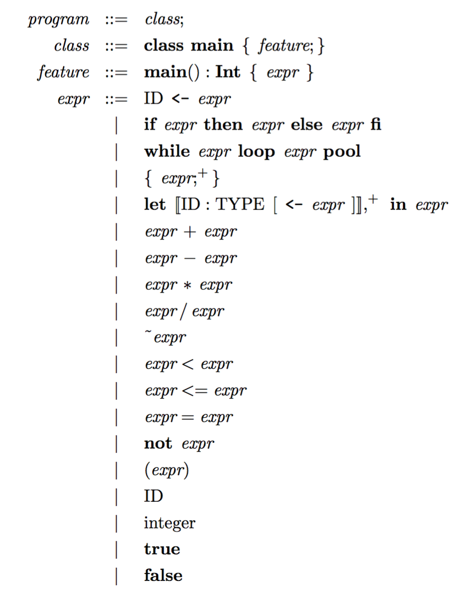

# Assignment: Code Generation, Phase 1

In this assignment you will implement the code generation phase
of the [Cool](cool.html) compiler for non-object-oriented
features of the language.

**DUE: March 30th, Thursday, 23:55.**

### Overview
In this phase,
we will write code generation capability for the following subset of Cool:

That is, we assume that the input programs will contain
a single Main class with a single method named main.
There will be no object-related expressions; i.e.
dynamic or static dispatch,
`case`, `isvoid`, or `new`.

The only types you must support are `Int and `Bool;
in particular, `String` is not included because it requires objects,
and `SELF_TYPE` is not needed in the absence of objects.
Additionally,
in this phase,
a loop expression has type `Int` and evaluates to the value 0.

The input to the code generator is the AST.
We assume that the AST have passed through semantic analysis for any potential errors;
so, do not attempt to do error checking during code generation, it's unnecessary.

As usual, a starter code will be provided for your convenience,
including several test inputs.

### Notes

1.  You can just generate `Int` and `Bool` constants as the `i32` and `i1` LLVM primitives.

2.  Some parts of the code generator, such as the
    arithmetic and comparison operators, have been written for you.
    Make sure you understand the given code very well. 

3.  Test your compiler! Test it often. 

4.  Since a `let`-variable has a local scope,
    we can allocate it in the current **stack** frame using the `alloca` instruction.
    All `alloca` instructions should be placed in the entry of the `let`-block
    to enable the `mem2reg` optimization so that `let`-variable can be promoted
    from the memory to an SSA register later on.

5.  Manage the environment carefully to introduce or remove bindings according to scoping rules.

8.  For `if-then-else`, you will need to utilize LLVM's `BasicBlock`s.
    The given code for loops shows you an example.
    The special thing about `if-then-else` is that 
    the result of an `if-then-else` is a merge of the results of the two branches.
    For this part, we assume that the both branches evaluate to `Int`s.
    So, you can allocate an `i32` in the stack right before or after generating code
    for the condition,
    and then store a different result into this allocated slot in each of the branches.
    Finally, at the merge block, load the value stored into this slot to get the result
    of `if-then-else`.

