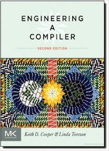

## Resources

**Textbook:**  

[_Engineering a Compiler, Second Edition_](https://www.elsevier.com/books/engineering-a-compiler/cooper/978-0-12-088478-0#)  
Keith Cooper, Linda Torczon.  
2011, Morgan Kaufmann. ISBN: 978-0-12-088478-0

[COMP 412: Compiler Construction at Rice](https://www.clear.rice.edu/comp412/)

[Cool Manual](cool.html)

[A Tourist’s Guide to the LLVM Source Code](http://blog.regehr.org/archives/1453)

[QBE: A Quick Backend](http://c9x.me/compile/)

[Crafting Intepreters](http://www.craftinginterpreters.com)

[Compiler Explorer](https://godbolt.org)
